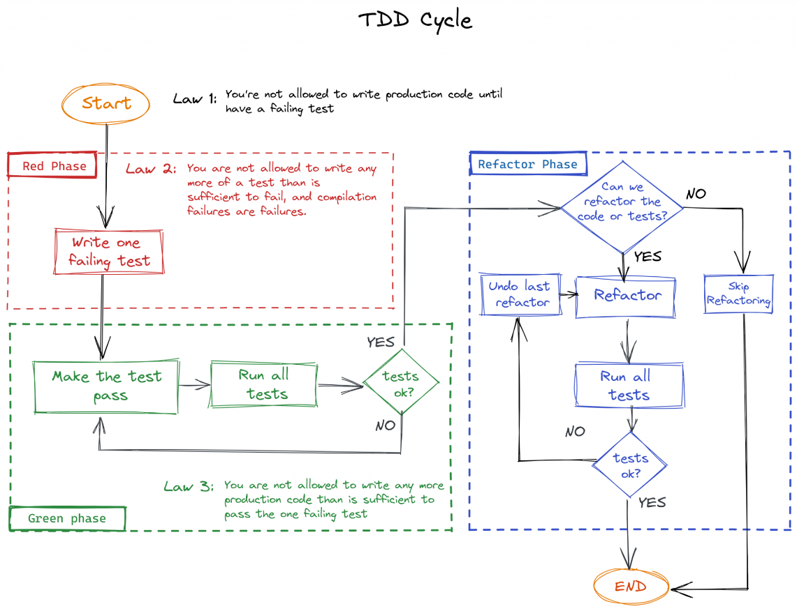

# Test Driven Development

1. Write a failing test
2. Make the test pass
3. Refactor

## TDD cycle



## Enablers

### Test list

> Identify some pieces of the solution that are testable, that you can soon design and build.
> Each item on the test list is a reminder of a test you think you might need.

eg:

1. [x] should do this when starting
2. [ ] should do that when something happen
3. [ ] ...

### Fake it

> Return a constant, which will later be replaced by a variable.

eg:
```typescript
  score = (): number => 0
```

### Obvious implementation

> If fast and simple, the real implementation may be directly written.

eg:
```typescript
  sum = (x: number, y: number): number => x + y
```

### Triangulation

> Write two or three examples before trying to generalize.

eg:
```typescript
  // before
  plusOne = (x: number): number => {
    if (x == 2) return 3
    if (x == 1) return 2
    return 1;
  }
  
  // after
  plusOne = (x: number): number => x + 1
```

### One to many

> To implement an operation on a collection, first start implementing for a single unit, then for the collection.

### Specific => Generic

> As the tests get more specific, the code gets more generic.

**After every Red-Green-Refactor cycle,** the implementation should be more generic than before.
